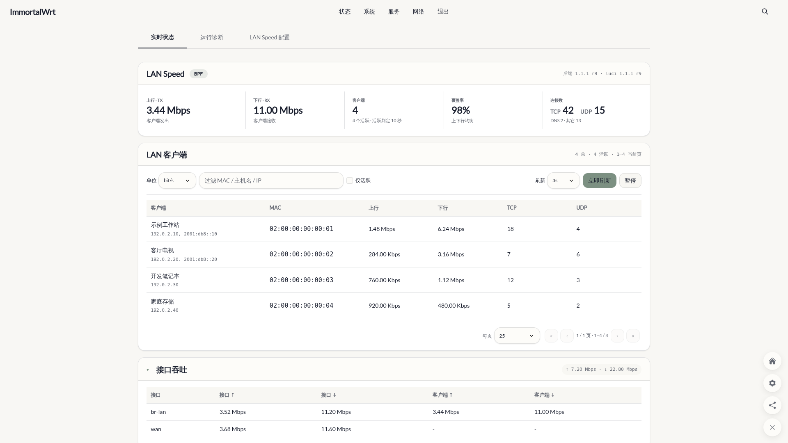
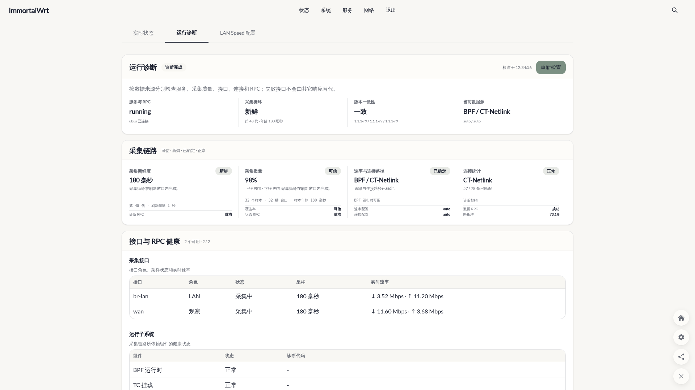
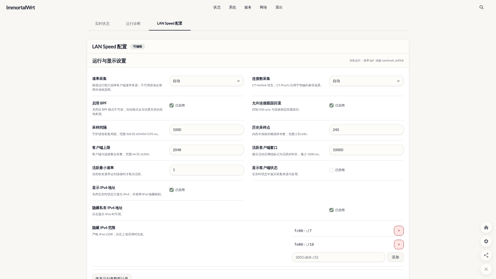
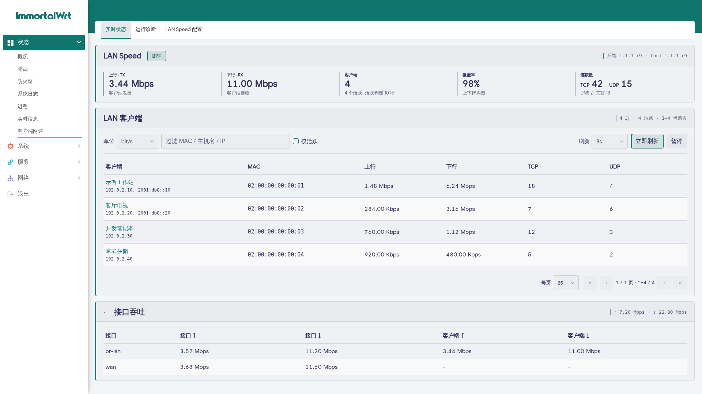
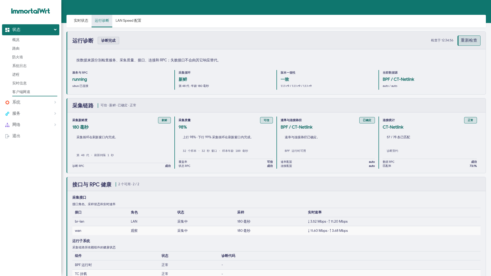
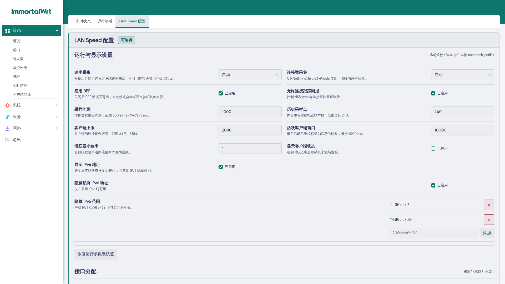
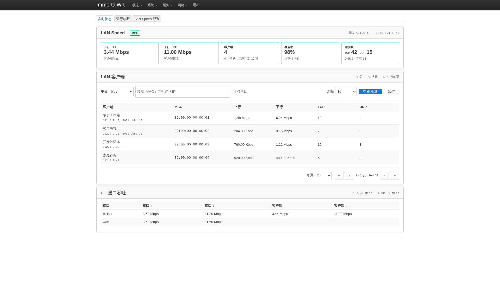
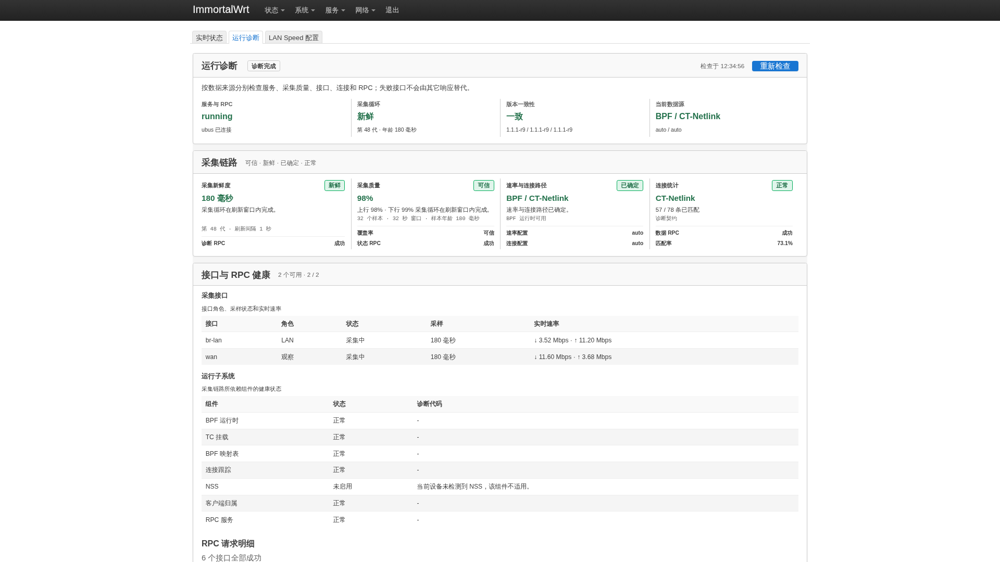
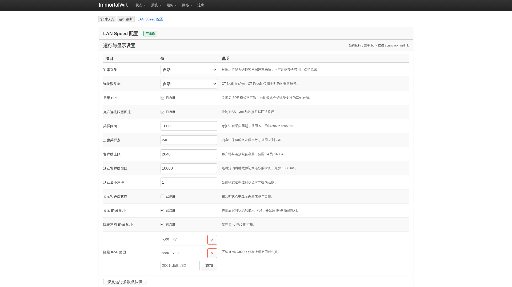

# luci-app-lanspeed

> 本仓库所有代码及文档（包括本 README）均由 AI 生成。

LAN 侧按客户端实时吞吐监控 + TCP/UDP 连接数统计，当前面向满足下述架构、工具链与内核能力要求的 ImmortalWrt / OpenWrt。

后端用户态 daemon 与 tc/eBPF 程序均使用 Rust 实现。daemon 内置最小 ubus/blobmsg wire codec、非阻塞 Unix Socket 事件循环和只读 UCI 解析器，不动态链接 OpenWrt 的 libubus、libubox、libblobmsg-json、libuci 或 uloop ABI；仓库不保留项目自有 C 后端。

本项目的定位是观察 CPU 可见 LAN 边缘流量：它不是完整流量审计系统，不声明全流量绝对准确。硬件加速、旁路网关、同网段直连、桥内转发、驱动 offload、代理 TUN/IFB 等路径可能让部分流量绕过 CPU 或改变可见方向。

## 界面预览

以下截图由真实 Chromium 分别在 **Aurora**、**Argon** 与 **Bootstrap** 主题中渲染最终页面，桌面端使用 `1920×1080` 视口，实时状态另附 `390×844` 移动端截图。页面 RPC 与 UCI 响应均为确定性合成数据，客户端只使用文档保留地址、虚构主机名和本地管理 MAC，不包含真实设备或路由器状态；图片已移除固件页脚及 PNG 元数据。点击预览可查看完整桌面原图。

| 主题 | 实时状态 | 运行诊断 | LAN Speed 配置 |
|---|---|---|---|
| **Aurora** | [](docs/screenshots/lanspeed-overview-aurora-desktop.png)<br>[移动端原图](docs/screenshots/lanspeed-overview-aurora-mobile.png) | [](docs/screenshots/lanspeed-diagnostics-aurora-desktop.png) | [](docs/screenshots/lanspeed-config-aurora-desktop.png) |
| **Argon** | [](docs/screenshots/lanspeed-overview-argon-desktop.png)<br>[移动端原图](docs/screenshots/lanspeed-overview-argon-mobile.png) | [](docs/screenshots/lanspeed-diagnostics-argon-desktop.png) | [](docs/screenshots/lanspeed-config-argon-desktop.png) |
| **Bootstrap** | [](docs/screenshots/lanspeed-overview-bootstrap-desktop.png)<br>[移动端原图](docs/screenshots/lanspeed-overview-bootstrap-mobile.png) | [](docs/screenshots/lanspeed-diagnostics-bootstrap-desktop.png) | [](docs/screenshots/lanspeed-config-bootstrap-desktop.png) |

## 安装与编译

在 ImmortalWrt / OpenWrt 源码根目录执行：

```sh
# 在 feeds.conf 中添加 lanspeed feed
echo "src-git lanspeed https://github.com/qimaoww/luci-app-lanspeed.git" >> feeds.conf

# 更新并安装
./scripts/feeds update lanspeed
./scripts/feeds install -a -p lanspeed

# 在 menuconfig 中选中 LuCI -> Applications -> luci-app-lanspeed
# BPF 是必选依赖，会自动选择 Network -> lanspeedd-bpf 和 lanspeedd
make menuconfig

# 多线程编译
make -j"$(nproc)" package/lanspeedd/compile
make -j"$(nproc)" package/luci-app-lanspeed/compile
```

`luci-app-lanspeed` 强制依赖 `lanspeedd-bpf`，后者会带上 `lanspeedd`；BPF 对象随 `lanspeedd` 源包一起编译，不需要单独执行 `package/lanspeedd-bpf/compile`。

## 特性

- **实时速率**：BPF tc 按 MAC + zone/VLAN 直接计数，字段为 `tx_bps` / `rx_bps`；生产运行默认加载只做流量统计的低开销对象，不再在每个转发包上计算未被响应使用的近似连接数。非 NSS 设备以 BPF 为实时来源；NSS ECM/PPE 活跃时 BPF 继续挂载观测慢路径，但客户端总速率以 NSS Conntrack 同步计数为准，绝不把两套累计值相加；短时静默客户端会保留隐藏计数基线，恢复流量时首个样本不再固定显示为 0。
- **连接数统计**：优先 CT-Netlink 读取 conntrack accounting，失败自动回退 CT-Procfs；TCP、UDP、DNS UDP 分开统计。
- **逐连接实时速率**：点击客户端名称进入连接详情后，按目标 IP 汇总并显示上行/下行速率；八列表头均可排序，默认把下行速度最高的目标放在最上面；展开目标可查看每条 TCP/UDP 连接各自的客户端视角 `tx_bps` / `rx_bps`。详情页提供与 LAN 客户端相同的 1/2/3/5/10 秒刷新选项和暂停按钮，但刷新设置独立保存，不影响客户端列表。单客户端详情最多返回 2048 条连接，仍保留全局 16384 条存储保护。
- **国家/地区**：详情页只对当前分页中去重后的公网目标 IP 由浏览器查询 GeoIP 源。先查询 `ipwho.is`；中国结果直接采用其省级行政区（例如 `中国·浙江`），不再请求其他源。非中国地址再并行查询 `ipinfo.io` 与 DB-IP，并按国家代码多数票显示；主源或单个备用源失败时仍可回退到其余结果。最多 4 个 IP 查询并发，并在浏览器本地保存有界的 7 天正缓存和 5 分钟负缓存。内网、代理 Fake-IP 与保留地址在本地直接分类，不增加 daemon CPU。显示结果是 IP 位置推测，可能受 CDN、Anycast、VPN 或代理影响；各公共源也可能有额度和限流策略。
- **NSS 兼容**：Qualcomm NSS 设备自动展示 ECM/PPE 状态。NSS 加速流量绕过 CPU tc hook，因此 `auto` 在 ECM/PPE 活跃且 `nf_conntrack_acct=1` 时以 NSS sync 为唯一权威字节来源；BPF 仍挂在 LAN 边缘收集慢路径和解速后的流量，用于诊断但不参与 NSS 总量相加。IPv4 通过 ARP、IPv6 通过 neighbor 表匹配客户端，并兼容 ECM NAT 端点。
- **活跃客户端**：默认只把 10 秒内仍有有效速率的客户端计为 active，可通过 UCI 调整。
- **覆盖率**：daemon 侧使用 32 个样本的滑动窗口，并按客户端实时速率生成单调累计分子，避免客户端离线/重新出现导致覆盖率跳回“采样中”；低流量与真正无流量分开显示。
- **独立诊断**：LuCI 内置“实时状态”“运行诊断”和“LAN Speed 配置”三个页签；诊断页分别校验 `diagnostics`、`status`、`health`、`clients`、`interfaces`、`overview` 六个 RPC 请求，展示采集覆盖率与样本新鲜度、速率/连接数据路径、接口与连接健康、分级告警及 LuCI/后端版本一致性。加载、空数据、部分失败、硬失败、降级、过期和异常契约均独立呈现，失败响应不会被其它接口“洗绿”；可复制报告只包含白名单状态与计数，不包含客户端地址或名称、接口名、探针源和原始后端文本。Aurora、Argon 与 Bootstrap 分别使用独立主题布局，实时状态页不再混入旧诊断面板。
- **配置页面**：速率与连接数采集模式、BPF/conntrack 运行开关、采样周期、历史样本、客户端上限、活跃判定、客户端状态列、IPv6 显示/隐藏规则和接口分配均可调整。整数、IPv6 CIDR 和接口列表采用严格校验；字段依赖与运行能力会禁用不适用的开关或选项并显示原因。页面使用 LuCI 原生“保存并应用 / 保存 / 重置”页脚，UCI 配置加载硬失败时会同时禁用并隐藏这些操作；修改后显示原生未保存配置指示，应用时由 procd 触发后端重载，并重新校验 `status` 与 `sysdevices`，成功、失败和可恢复编辑状态都有明确反馈。
- **接口配置**：采集 / 观察 / 关闭 三态切换，默认采集 `br-lan`、观察 `wan`；异步扫描具有代次保护，并显示缺失接口、数量限制和不可采集原因。自动忽略 `dae*`、`miireg*`、`tun*`、`erspan*`、`gretap*`、`gre*`、`ip6gre*`、`ip6tnl*`、`sit*`、`bonding_masters*`，拒绝 nssifb 采集并可观察 WAN / ifb 计数。
- **告警体系**：OpenClash / dae/daed / SQM/qosify/ifb / flow offload / fullcone NAT 等场景自动识别并提示。
- **客户端状态列**：默认隐藏 LAN 客户端的采集来源与告警状态，可在“LAN Speed 配置”中开启。
- **版本显示**：LuCI 状态页显示完整版本，例如 `1.1.3-r1`。

## 采集策略

### 速率采集

`rate_collector_mode` 控制客户端实时速率：

| 值 | 行为 |
|---|---|
| `auto` | 默认模式。非 NSS 设备优先使用 BPF；NSS ECM/PPE 活跃且 Conntrack accounting 可用时优先使用 NSS sync，同时保留 BPF 慢路径观测；sync 不可用才回退 NSS-direct。 |
| `bpf` | 强制只使用 BPF 测速；BPF 不可用时不回退 NSS，适合确认 LAN 边缘 BPF 路径。 |
| `nss_ecm_direct` | 手动尝试 NSS-direct；direct 没有有效速率时仍使用 NSS sync 后备，避免显示 0。 |
| `nss_conntrack_sync` | 强制使用 NSS sync；只适合 NSS ECM/PPE 设备排查或 direct 不可用时使用。 |

非 NSS 设备不会把 CT 当作实时测速来源。CT 只能用于连接数、诊断和 NSS ECM/PPE sync 这类明确标注的 fallback。

daemon 启动时立即由 Rust 扫描 `/proc/<pid>/comm`，之后至多每 5 秒扫描一次，只把精确名称为 `dae` 或 `daed` 的进程视为运行态，不依赖 `pidof` 或慢速环境探测缓存。非 NSS 自动模式检测到 dae/daed 运行状态变化后，会立即把 LAN BPF 从 Normal（pref `49152`）事务切换到 Early passthrough（pref `1`），进程停止后切回 Normal。NSS 设备仍以 NSS sync 作为权威速率来源，BPF 只保持慢路径观测；切换复用 reload 的 suspend/attach/rollback 流程并保留外部 tc filter。

NSS-direct 是显式选择 `nss_ecm_direct` 或 NSS sync 不可用时的后备来源。daemon 只读 qca-nss-ecm 的 state 设备（`/dev/ecm_state` 或 debugfs major 在 `/dev` 下创建的临时只读节点），解析 ECM flow 的 `adv_stats.from_data_total` / `adv_stats.to_data_total`，再按两端 IP、NAT IP 和 node MAC 匹配 LAN 客户端。它不写 `defunct_all`、`flush`、`decelerate`，也不修改 NSS 状态。direct 只描述加速流，不会覆盖同一客户端的 Conntrack sync 样本；部分固件的 ECM state 可能没有活跃 flow、计数为 0 或覆盖不完整，此时会显示 `nss_direct_no_data` / `nss_direct_partial`。

NSS ECM/PPE sync 是自动模式下 NSS 加速设备的首选来源，也是显式选择 `nss_conntrack_sync` 或 direct 失败时的后备来源。NSS 硬件加速 flow 的字节计数同步回 conntrack 后，daemon 再读取 CT-Netlink / CT-Procfs 的 accounting 计数。这个路径会匹配 conntrack 原始方向和回复方向的源/目的端点，按 LAN 客户端视角换算上下行；每条 Conntrack flow 先独立计算计数增量，再按客户端汇总，某条 flow 过期或计数重置不会把同一客户端其他活跃 flow 的本周期速率归零。CT-Netlink 还使用内核 `CTA_ID + CTA_ZONE` 区分快速复用同一五元组的新旧 flow，并把已消失 flow 的基线保留 60 秒；若只能使用 procfs，则采用 `zone + tuple` 并把保留窗口缩短为 2 秒，避免跨代误算。`status`、`health` 与 `clients` 的 evidence 会返回实际 `CTA_ID` 覆盖率和基线参数。它只在 NSS ECM/PPE 场景作为实时速率来源，非 NSS 设备不会把 conntrack 当作实时测速来源。

诊断页把“运行健康”和“统计准确度”分开：成功且契约有效的 `status` / `health` RPC 显示为正常；NSS 同步周期、短流可见性和实测覆盖率只进入“采集质量/速率路径”证据，不再把正常返回的运行接口误标成“降级”。

### 连接数采集

`conn_collector_mode` 控制 TCP/UDP 连接数来源：

| 值 | 行为 |
|---|---|
| `auto` | 优先 CT-Netlink，失败回退 CT-Procfs。 |
| `conntrack_netlink` | 强制使用 CT-Netlink。 |
| `conntrack_procfs` | 强制使用 `/proc/net/nf_conntrack`。 |

连接数语义为 `conntrack_current_tcp_established_assured_udp_assured_dns_split`：TCP 统计已建立/确认连接，UDP 只统计已确认（ASSURED）的 conntrack 项，并把 DNS UDP 单独拆分。内核对 flow-offload 项会隐藏普通 TCP 状态或 `[ASSURED]` 文本，CT-Netlink 和 CT-Procfs 会按 offload 状态恢复等价语义，避免后备路径漏计。

顶部汇总、overview 和客户端表使用同一份完整的当前连接快照。已退出 `active_client_window_ms` 速率窗口但仍有连接的客户端会保留为 `CT-Netlink` / `CT-Procfs` 行，速率显示为 0 并提示 `conntrack_connection_only`；因此未启用搜索或“仅活跃”过滤时，表格 TCP/UDP 行合计与顶部严格一致，活跃客户端数仍只由实时速率判断。

## 包组成

| 包 | 说明 |
|---|---|
| `lanspeedd` | Rust/Aya daemon，暴露九个 ubus 方法（status / clients / overview / health / diagnostics / reload / interfaces / sysdevices / client_connections） |
| `lanspeedd-bpf` | LuCI 应用的必选依赖，安装 Rust 编译的低开销字节统计对象与 kfunc 兼容对象；生产运行默认使用低开销对象，精确连接数统一来自 conntrack，并依赖 `lanspeedd` |
| `luci-app-lanspeed` | LuCI 实时状态、独立诊断和配置页，强制依赖 `lanspeedd-bpf`，模块化前端（status / diagnostics / config / client detail） |

## 编译要求与高级用法

### 支持范围

| 目标 | 说明 |
|---|---|
| `x86_64` LP64 | 支持。当前构建、打包和路由器实测目标。 |
| `aarch64` LP64 | 支持。Release 分别提供 `aarch64_generic`、`aarch64_cortex-a53`、`aarch64_cortex-a72` 和 `aarch64_cortex-a76`，必须按固件的包架构选择；交叉编译通过不等于具体设备已完成真机验证。 |
| 32 位 ARM、i386 和 MIPS | 不支持。当前 Rust/BPF 工具链、LuCI 运行时和 LP64 数据模型不覆盖这些目标。 |

### Rust 编译器兼容

| 验证路径 | 最低版本 | 本次最高已验证版本 | 证据范围 |
|---|---:|---:|---|
| daemon、共享 ABI、构建驱动和纯 Rust ubus/UCI/uloop host 测试 | `1.87.0` | `1.97.1` | `1.87.0` 到 `1.97.1` 的每个稳定版逐版完成编译和测试。 |
| kfunc 与 fallback 两套 eBPF `build-std=core` 对象 | `1.87.0` | `1.97.1` | 每版独立构建目录；逐个检查 EM_BPF、BTF、classifier/maps/license section 及 32/64 位原子指令。 |
| 低于 MSRV | 不支持 | `1.86.0` 已验证拒绝 | Cargo 明确报告 workspace 与 Aya 依赖要求 Rust 1.87，不把任意编译错误当作边界证据。 |

workspace 的 `rust-version` 与构建驱动统一使用 `1.87.0`，CI 同时覆盖 MSRV、固定发布编译器、内部 atomic intrinsic 的版本转折点和浮动 stable。`1.97.1` 是本次最高实测版本，不是人为设置的上限；后续 stable 必须先通过同一矩阵才能加入已验证范围。外部提供的 `BPF_LINKER` 接受稳定版 `bpf-linker >= 0.10.3, < 0.11.0`。OpenWrt 包构建仍下载并校验固定的 `bpf-linker 0.10.3` 发布归档及 SHA256，以保证离线构建可复现。Rust 与 `bpf-linker` 的预发布版本仍会被拒绝。

这个矩阵只证明源码与 Rust 工具链兼容。x86_64-musl、aarch64-musl 和 APK 仍分别使用目标 SDK 做链接、架构、动态依赖及 BPF/BTF 门禁；交叉编译结果也不等于任意固件或设备已完成真机验证。较旧 SDK 可以作为目标 sysroot，但构建主机仍须提供满足 MSRV 的 Rust；这不会重新引入目标设备的 libubus/libubox ABI。

### 用户态与 BPF 必选包

- `luci-app-lanspeed` 必须依赖 `lanspeedd-bpf`，`lanspeedd-bpf` 再依赖用户态 daemon `lanspeedd`；在 menuconfig 中选择 LuCI 应用会自动选中完整依赖链。
- `lanspeedd-bpf` 的标准 OpenWrt 包构建使用固定的 `bpf-linker 0.10.3` 构建两套 Rust eBPF 对象；显式传入兼容版本的 `BPF_LINKER` 时，构建驱动按上述版本范围校验。目标机必须提供 `tc-full` 和 `kmod-sched-bpf`。统一使用多数流控插件采用的 `tc-full`，避免与 `tc-tiny` 的包冲突。
- daemon 使用 `tc-full` 的 JSON 明细核对 chain、pref、handle、BPF 类型、内核程序 ID、全协议 direct-action 与软件执行状态；通过 RTNetlink TC 事件触发精确复核，并保留 30 秒强制审计。监听不可用、溢出或报文异常时会退回逐周期完整审计；实际对象加载、hook 挂载和 map 读取结果优先于 `tc help` 的文字与返回码，避免兼容输出误报降级。
- 当前固定的 `bpf-linker` 发布包要求 x86_64 编译主机，目标路由器架构仍由 OpenWrt SDK 决定。
- NSS sync 是 ECM/PPE 加速活跃时自动模式的权威来源；NSS-direct 保留为显式模式和 sync 不可用时的后备。两者都不替代 LuCI 应用对 `lanspeedd-bpf` 的安装依赖，BPF 仍用于慢路径观测。

### 内核与包配置要求

```
CONFIG_DEVEL=y
CONFIG_KERNEL_DEBUG_INFO=y
CONFIG_KERNEL_DEBUG_INFO_BTF=y
CONFIG_KERNEL_BPF_EVENTS=y
CONFIG_PACKAGE_kmod-nf-conntrack=y
CONFIG_PACKAGE_kmod-nf-conntrack-netlink=y
CONFIG_PACKAGE_kmod-sched-bpf=y
CONFIG_PACKAGE_tc-full=y
```

缺少 `lanspeedd-bpf`、tc 或内核 BPF 支持时属于不完整安装，默认实时速率不可用。daemon 仍可能显示连接数与环境诊断；NSS 设备也可能在 BPF 运行失败后使用 NSS-direct / ECM/PPE sync 后备，但这不取代必选 BPF 依赖。

### 运行时依赖

| 包 | 必需 | 说明 |
|---|---|---|
| `ubusd` | yes | 系统消息总线服务；daemon 直接连接 `/var/run/ubus/ubus.sock`，不链接其客户端库 |
| `libubox` / `libubus` / `libuci` / `libblobmsg-json` | no | daemon 的 ELF 和 APK 元数据不依赖这些版本化用户态 ABI |
| `libgcc`（APK 中按工具链 ABI 解析，如 `libgcc1`） | yes | Rust unwind 与目标工具链运行时提供 `libgcc_s.so.1`；包管理器自动选择匹配固件的版本 |
| `kmod-nf-conntrack` | yes | conntrack 表访问 |
| `kmod-nf-conntrack-netlink` | yes | CT-Netlink 连接数读取 |
| `tc-full` (iproute2) | yes | `lanspeedd-bpf` 的 tc clsact 挂载依赖，并与常见流控插件保持一致 |
| `kmod-sched-bpf` | yes | `lanspeedd-bpf` 的内核 tc BPF classifier 依赖 |
| `luci-base` | LuCI 页面 | LuCI 框架 |

用户态 JSON 和 blobmsg 编码使用 Rust 实现，CT-Netlink 使用 Rust 原始 netlink 实现，eBPF 对象由 Aya 加载，不直接依赖 `libjson-c`、`libmnl` 或 `libbpf`。blobmsg 与对象注册编码由真实 SDK 的 `libubox` / `libubus` 独立生成 golden bytes 做逐字节回归；JSON 正整数只在 `i32` 范围内使用 INT32，更大值使用 INT64，超过 `i64::MAX` 时保持旧 json-c 的饱和语义。ubus 传输限制单帧为 1 MiB、待发送队列为 4 MiB，并对长度、填充、重复字段、UTF-8、断线和超时执行失败关闭；连接恢复后重新注册同一组九个方法。NSS ECM/PPE 活跃时默认使用 NSS sync 权威计数并保留 BPF 慢路径观测；NSS-direct 仅在显式模式或 sync 不可用时启用，不额外依赖用户态库，但需要内核侧 qca-nss-ecm 暴露 ECM state 设备。IPv6 客户端匹配依赖内核 neighbor 表；前端隐藏 IPv6 只影响显示，不影响采集匹配。

### 本地 checkout / SDK 辅助脚本

仓库内的 `scripts/build-sdk.sh` 适合贡献者在本地 checkout 上重复验证。它使用 `src-link` 临时接入现有 SDK，自动选择包并执行相同的 `package/lanspeedd/compile` 和 `package/luci-app-lanspeed/compile` 目标：

```sh
SDK_DIR=/openwrt/immortalwrt ENABLE_BPF=1 DRY_RUN=1 scripts/build-sdk.sh
SDK_DIR=/openwrt/immortalwrt ENABLE_BPF=1 scripts/build-sdk.sh
```

辅助脚本的 `ENABLE_BPF` 默认值为 `1`，正常 LuCI 应用构建应保持启用。

普通用户从 GitHub 构建时优先使用前面的 `src-git lanspeed` feed 流程；辅助脚本不会下载 SDK 或工具链。

ABI 注意点：纯 Rust 用户态 daemon 不再绑定 libubox/libubus/libuci 的日期 SONAME，但这不等于一个 APK 可以安装到所有固件。APK 架构、musl 基线、LuCI 运行时和 `lanspeedd-bpf` 的内核能力仍须与目标固件匹配，不能伪造架构或把 BPF 包强装到不兼容内核上。未纳入实机验收的设备必须使用对应 SDK 重建，且不得仅凭交叉编译结果声明已经验证。

回滚时三个包应作为同一版本集合降级，避免混用用户态协议契约和采集资产。先备份 `/etc/config/lanspeed` 与当前三包，再执行：

```sh
/etc/init.d/lanspeedd stop
apk add --allow-untrusted \
  ./lanspeedd-<old>.apk ./lanspeedd-bpf-<old>.apk ./luci-app-lanspeed-<old>.apk
/etc/init.d/lanspeedd start
```

停止服务会由 init 脚本清理其 tc hook；不要只替换 BPF 对象，也不要在共享路由器上通过终止系统 `ubusd` 测试重连。`rpcd`、`uhttpd` 等其它守护进程未必能在 `ubusd` 更换后自动恢复，可能导致 LuCI 登录或 RPC 暂时失效。断线、重连与重新注册测试应使用 SDK rootfs 中的隔离 `ubusd`。

若外部操作已经替换过共享 `ubusd`，先执行 `/etc/init.d/rpcd restart`，并以 `ubus call luci getFeatures '{}'` 确认 `luci` 对象恢复；只有该命令成功而浏览器 HTTP RPC 仍失败时才重启 `uhttpd`。正常部署和实机验收只允许重启 `lanspeedd`。

参考验收中，设备端 daemon 的 RSS 为 3388 KiB；单线程连续完成 100 次本机 `ubus call lanspeed health` 用时 0.07 秒，这只是控制面 RPC microbenchmark，不能用于证明测速热路径性能。九个方法与非法参数语义均通过，超过 `i32::MAX` 的接口累计字节保持正整数；真实流量下 ingress/egress 两个 BPF hook 均已 JIT，覆盖率为 RX 99% / TX 99%，探针失败数为 0，LuCI 概览与 HTTP RPC 验证通过。隔离 SDK rootfs 的真实 wire 测试覆盖对象注册和调用，并以测试代码显式执行重连与重新注册；daemon 自动重连及同一组九方法重新注册由 lifecycle mock 回归覆盖。所有断线测试都不得在共享实机终止 `ubusd`。这些数字用于回归参考，不是对不同 CPU、负载或固件的延迟保证。

架构支持与验收层级以上表为准；任何交叉编译结果都不能代替具体设备的真机验证。普通代码 push 和 pull request 由独立 CI workflow 执行完整单元校验。当 `main` 分支上的 `net/lanspeedd/Makefile` 或 `applications/luci-app-lanspeed/Makefile` 改动导致完整版本发生变化时，发布 workflow 会自动编译 x86_64，以及 `aarch64_generic`、`aarch64_cortex-a53`、`aarch64_cortex-a72`、`aarch64_cortex-a76` 四种独立 ARM64 包架构。每个架构先构建 base 包，再把已安装的 Rust/Cargo 主机工具链复用于 BPF 构建；该工具链按 runner 操作系统与架构、目标架构、SDK SHA256、feeds 实际 revision、Rust 配方版本和内容哈希隔离缓存，恢复后还会核对实际 `rustc`，后续相同 SDK 不再从头编译 Rust。workflow 会先创建草稿 Release，为每个架构上传三个独立 APK 和一个包含这三个 APK 的 `.tar.gz` 压缩包，并校验全部 20 个资产的名称、状态和 SHA256，再发布对应的 `v*` tag 和 GitHub Release，维护者不得预先创建 `v*` tag。构建或上传失败时保留的草稿 Release 可由同一版本提交使用 `workflow_dispatch` 自动重建；手动运行也可补发没有 tag/Release 的当前版本，无需通过 `HEAD^1` 制造新的版本变化。

## 配置

LuCI 入口：

- `状态 -> 客户端网速 -> 实时状态`
- `状态 -> 客户端网速 -> 实时状态 -> 点击客户端名称进入连接详情页`
- `状态 -> 客户端网速 -> 运行诊断`
- `状态 -> 客户端网速 -> LAN Speed 配置`

`/etc/config/lanspeed`：

```uci
config lanspeed 'main'
    option refresh_interval_ms '1000'
    option active_client_window_ms '10000'
    option active_client_min_bps '1'
    option overview_window_samples '240'
    option rate_collector_mode 'auto'
    option conn_collector_mode 'auto'
    option show_client_status '0'
    option show_ipv6 '1'
    option hide_private_ipv6 '0'
    option hide_ipv6_ranges 'fc00::/7 fe80::/10'
    option collector_mode 'auto'
    option max_clients '2048'
    list ifname 'br-lan'
    list interface_include 'br-lan'
    list interface_exclude 'wan'
    list observe 'wan'
    option enable_bpf '1'
    option enable_conntrack_fallback '1'
```

常用 UCI：

```sh
uci set lanspeed.main.rate_collector_mode='auto'
uci set lanspeed.main.conn_collector_mode='auto'
uci set lanspeed.main.active_client_window_ms='10000'
uci set lanspeed.main.active_client_min_bps='1'
uci set lanspeed.main.show_ipv6='1'
uci set lanspeed.main.hide_private_ipv6='0'
uci set lanspeed.main.hide_ipv6_ranges='fc00::/7 fe80::/10'
uci commit lanspeed
/etc/init.d/lanspeedd restart
```

配置说明：

客户端详情页支持编辑主机名。编辑器按客户端 MAC 读取 `/etc/config/dhcp` 的
`config host` 条目，保存时只写入 `option mac` 和 `option name`，不会自动写入
`option ip`；不设置 IP 时地址仍由 DHCP 动态分配。dnsmasq 应用配置后，lanspeedd
也会优先使用该静态 DHCP 主机名，运行时租约文件仅作为兜底来源。

| 选项 | 默认 | 说明 |
|---|---:|---|
| `refresh_interval_ms` | `1000` | daemon 采样间隔；配置页允许 `500` 到 `4294967295` ms 的完整整数。 |
| `active_client_window_ms` | `10000` | 活跃客户端最近可见窗口；配置页要求不低于 `1000` ms。 |
| `active_client_min_bps` | `1` | 活跃客户端最低当前速率；配置页要求不低于 `1` bps。 |
| `overview_window_samples` | `240` | 趋势/概览样本窗口；配置页允许 `2` 到 `240` 个样本。 |
| `rate_collector_mode` | `auto` | 速率采集：`auto` 在非 NSS 设备使用 BPF，在 NSS ECM/PPE 活跃且 Conntrack accounting 可用时使用 NSS sync；也可显式选择 `bpf` / `nss_ecm_direct` / `nss_conntrack_sync`。 |
| `conn_collector_mode` | `auto` | 连接数采集：`auto` / `conntrack_netlink` / `conntrack_procfs`。 |
| `show_client_status` | `0` | 是否在 LAN 客户端列表中显示采集来源和告警状态。 |
| `show_ipv6` | `1` | 客户端列表是否显示 IPv6 地址；关闭时私有 IPv6 与范围编辑会禁用。 |
| `hide_private_ipv6` | `0` | 是否启用 IPv6 隐藏规则；仅在 `show_ipv6=1` 时可编辑。 |
| `hide_ipv6_ranges` | `fc00::/7 fe80::/10` | 严格校验的 IPv6 CIDR 列表；仅在 `show_ipv6=1` 且 `hide_private_ipv6=1` 时生效。 |
| `collector_mode` | `auto` | 旧配置兼容字段，配置页会根据速率与连接数模式同步推导。 |
| `max_clients` | `2048` | 客户端与连接聚合容量；配置页允许 `64` 到 `16384`。 |
| `ifname` | `br-lan` | 旧版采集接口兼容列表；配置页在接口三态流程中透明保留并同步。 |
| `interface_include` | `br-lan` | 按客户端采集实时速率的接口列表。 |
| `interface_exclude` | `wan` | 旧版兼容排除列表；不会形成第二套可分配接口模式。 |
| `observe` | `wan` | 只显示接口总吞吐、不按客户端归属流量的观察接口列表。 |
| `enable_bpf` | `1` | BPF 运行时开关；`lanspeedd-bpf` 仍是安装必选依赖，关闭后 BPF 模式不可选。 |
| `enable_conntrack_fallback` | `1` | 是否允许 conntrack 连接数与 NSS sync 回退路径。 |

## ubus 调试

```sh
ubus call lanspeed status       # Full / Degraded / Unsupported、high / medium / low / unsupported、能力、告警、版本
ubus call lanspeed clients      # 客户端 tx_bps/rx_bps + TCP/UDP/DNS 连接数
ubus call lanspeed overview     # 总速率、客户端数、active_clients、连接数窗口
ubus call lanspeed health       # 健康检查 + 冲突检测
ubus call lanspeed diagnostics  # 结构化采集新鲜度、数据路径、接口/连接健康、版本与脱敏告警
ubus call lanspeed reload       # 刷新 lanspeedd 运行状态，不写持久 UCI 配置
ubus call lanspeed interfaces   # 接口吞吐 + 覆盖率
ubus call lanspeed sysdevices   # 系统网络设备列表
ubus call lanspeed client_connections \
  '{"identity_key":"02:00:00:00:00:42@br-lan"}'
```

`client_connections` 的 `identity_key` 来自 `clients` 响应。它返回该客户端当前 conntrack 快照：TCP 仅统计 ESTABLISHED + ASSURED，UDP 仅统计 ASSURED；这不是历史连接记录。每条连接的 `tx_bps` / `rx_bps` 由相邻 conntrack 累计字节快照计算，方向始终以客户端为准；新连接首个样本为 0，计数器回退时对应方向为 0，时间回退时本次速率为 0。响应中的 `limit`、`returned_connections` 和 `truncated` 用于说明截断情况。LuCI 实时状态表中点击客户端名称即可进入连接详情页，目标行显示聚合速率，展开后显示每条实际连接的速率；发生截断时，速率仍直接显示数值，页脚会说明分组速率仅汇总已返回的连接子集。

关键字段：

| 字段 | 说明 |
|---|---|
| `mode` | `Full` / `Degraded` / `Unsupported`。 |
| `confidence` | `high` / `medium` / `low` / `unsupported`。 |
| `collector_mode` | 兼容旧字段，当前等价于速率配置视角。 |
| `rate_collector_mode` | 实时速率配置。 |
| `conn_collector_mode` | 连接数配置。 |
| `conn_source` | 实际连接数来源：`nss_ecm_direct` / `conntrack_netlink` / `conntrack_procfs` / `conntrack`。 |
| `conn_semantics` | 连接数统计语义。 |
| `connections[].tx_bps` / `rx_bps` | 当前连接的客户端视角上行 / 下行速率；依赖 conntrack accounting 的连续快照。 |
| `coverage` | daemon 侧滑动窗口覆盖率。 |
| `active_client_window_ms` | 活跃客户端窗口。 |
| `active_client_min_bps` | 活跃客户端最小速率。 |
| `router_self` | 路由器自身流量/代理链路的识别提示。 |

## 兼容性与边界

| 场景 | 影响 |
|---|---|
| OpenClash fake-ip | 远端地址置信度降低，可能出现 `openclash_fake_ip_low_remote_confidence`。 |
| OpenClash TUN/mix | TUN/mix 会改变 hook 顺序，可能出现 `openclash_tun_conntrack_low_confidence`。 |
| OpenClash DNS 链 | DNS 重定向链不完整时会提示 `openclash_dns_chain_incomplete`。 |
| dae/daed | 代理接口不作为客户端身份，探测到时提示 `dae_detected`；运行态启动时立即扫描、之后至多每 5 秒由 `/proc/<pid>/comm` 刷新，状态变化仍触发事务 reload；非 NSS 自动模式优先 BPF 并切到 Early passthrough，NSS 设备保持 NSS sync 权威计数与 BPF 慢路径观测。 |
| SQM/qosify/ifb | 可能影响方向判断或覆盖范围，对应 `sqm_detected`、`qosify_detected`、`ifb_detected`。 |
| hardware flow offload | 硬件转发绕过 CPU，BPF 不可见，提示 `hardware_flow_offload_unsupported`。 |
| software flow offload | 告警但不阻止采集，提示 `software_flow_offload_enabled`。 |
| fullcone NAT | 连接语义可能受影响，提示 `fullcone_nat_enabled`。 |
| NSS ECM / PPE | 硬件加速流量绕过 CPU，默认以 NSS sync / CT-Netlink 作为客户端权威计数；BPF 保持挂载但只观察慢路径，NSS-direct 仅作显式或 sync 失败后备，PPE direct 第一版只探测状态且不写 NSS 状态。 |
| nssifb | 只能观察，不允许作为 BPF 采集接口，避免镜像接口重复计数。 |
| same-subnet side-router direct | 同网段旁路由直连可能绕过主路由，提示 `same-subnet side-router direct` 相关风险。 |
| router-local | 路由器本机进程流量不会自然映射成 LAN 客户端。 |
| LAN-to-LAN | 桥内或交换芯片内转发 CPU 不可见，可能提示 `lan_to_lan_visibility_limited`。 |
| VLAN/Wi-Fi | 使用 MAC + zone/VLAN 区分身份；重复 MAC 可能提示 `duplicate_mac_across_vlans`。 |
| PPPoE/WG/TUN | PPPoE/WG 外层接口可观察，TUN 配置候选自动忽略；客户端身份仍以 LAN 边缘为准，路径不对称时可能提示 `asymmetric_path_possible`。 |
| flowtable counter | 缺失计数会提示 `flowtable_counter_missing`。 |
| nlbwmon | 同类计数器共存可能提示 `nlbwmon_counter_conflict`。 |
| conntrack fallback | 非 NSS 不用于实时测速，只用于连接数和诊断；NAT-only 可提示 `conntrack_routed_nat_only`。 |
| tc 冲突 | 发现外部 tc filter 可能提示 `tc_filter_conflict`。 |
| BPF map 满 | 客户端超过容量可能提示 `map_full`。 |

## 故障排查

| 现象 | 检查 |
|---|---|
| SDK 缺失 | 确认 `SDK_DIR` 指向真实 SDK，例如 `/openwrt/immortalwrt`。 |
| 缺少 BPF 包或对象 | `lanspeedd-bpf` 是 LuCI 应用的必选依赖；检查包依赖和 `/usr/lib/bpf/lanspeed-ebpf-kfunc`、`/usr/lib/bpf/lanspeed-ebpf-fallback`。 |
| 缺少 `tc` | 安装 `tc-full`。 |
| 连接数全 0 | 检查 `nf_conntrack_acct`、`kmod-nf-conntrack-netlink`、`conn_collector_mode`。 |
| 没有客户端 | 检查 LAN 接口配置、桥设备、BPF 是否 attach 成功。 |
| 速率长时间为 0 | 先检查 `rate_collector_mode`、BPF 包、tc filter、硬件 flow offload；NSS 设备确认 `effective_rate=nss_conntrack_sync`、`counter_source=ecm_conntrack_sync` 和 Conntrack accounting，再看 `nss_ecm_direct_unavailable` / `nss_ecm_direct_snapshot_pending`；IPv6 场景同时检查客户端是否出现在 neighbor 表。 |
| OpenClash 或 dae/daed 共存 | 确认 BPF attach 在 LAN 边缘并观察 health warning；NSS 设备同时确认 `effective_rate=nss_conntrack_sync`，避免把 BPF 慢路径与 NSS 计数相加。 |
| 覆盖率低 | 检查硬件 offload、旁路网关、LAN-to-LAN、IFB/TUN 等 CPU 不可见路径。 |

## 项目结构

```
applications/luci-app-lanspeed/
  htdocs/luci-static/resources/
    lanspeed/                      状态、诊断、配置与客户端详情模块
    view/lanspeed/overview.js      实时状态入口
    view/lanspeed/diagnostics.js   独立运行诊断入口
    view/lanspeed/config.js        LAN Speed 配置页面
net/lanspeedd/
  rust/crates/lanspeedd/           Rust daemon、采集器、状态机和 ubus 逻辑
  rust/crates/lanspeed-ebpf/       Rust/Aya eBPF 程序（默认 tc 字节统计；保留 ct_lookup 兼容对象）
  rust/crates/lanspeed-common/     用户态与 eBPF 共用 ABI
  rust/crates/lanspeed-openwrt-sys/ 纯 Rust ubus/blobmsg、事件循环与 UCI 兼容层
  rust/crates/lanspeed-build/      OpenWrt 用户态与 eBPF 构建驱动
  src/collector-model.json         采集模型说明
  files/                           设备端文件 (init.d / UCI config / schema)
scripts/build-sdk.sh               SDK 编译辅助脚本
.github/workflows/ci.yml           普通 push / pull request 单元校验
.github/workflows/build-sdk.yml    GitHub Actions 自动编译
tests/                             本地回归测试
```

## 测试

本地环境可以运行确定性检查脚本和不依赖目标用户态 ABI 的 Rust 单元/合约测试；`./tests/run.sh unit` 覆盖 `lanspeedd`、共享 ABI、构建驱动、诊断模型和 fixtures。纯 Rust OpenWrt 层会同时在 host 与 musl 目标运行，并启动 SDK rootfs 中的真实 `ubusd`，用系统 `ubus` 客户端验证对象注册、调用、回复、断线和重新注册；链接门禁使用 `readelf` 证明 daemon 不含四个已移除库的 `DT_NEEDED`。最终产物仍由真实 SDK 编译并在目标设备验收。构建要求稳定版 `Rust >= 1.87.0`。

```sh
./tests/run.sh unit
sh tests/validate-lanspeed-docs.sh
```

后续设备验证可先运行 dry-run 审阅九个 ubus 方法及动态详情命令模板；确认目标设备和 SSH 参数后，再采集真实 evidence。`collect` 中的 `reload` 只刷新 lanspeedd 运行状态，不修改持久 UCI、网络、防火墙或代理配置。

```sh
DRY_RUN=1 TARGET=root@router OUT_DIR="$(mktemp -d)" sh tests/qa-device.sh collect
```

## License

Apache-2.0
