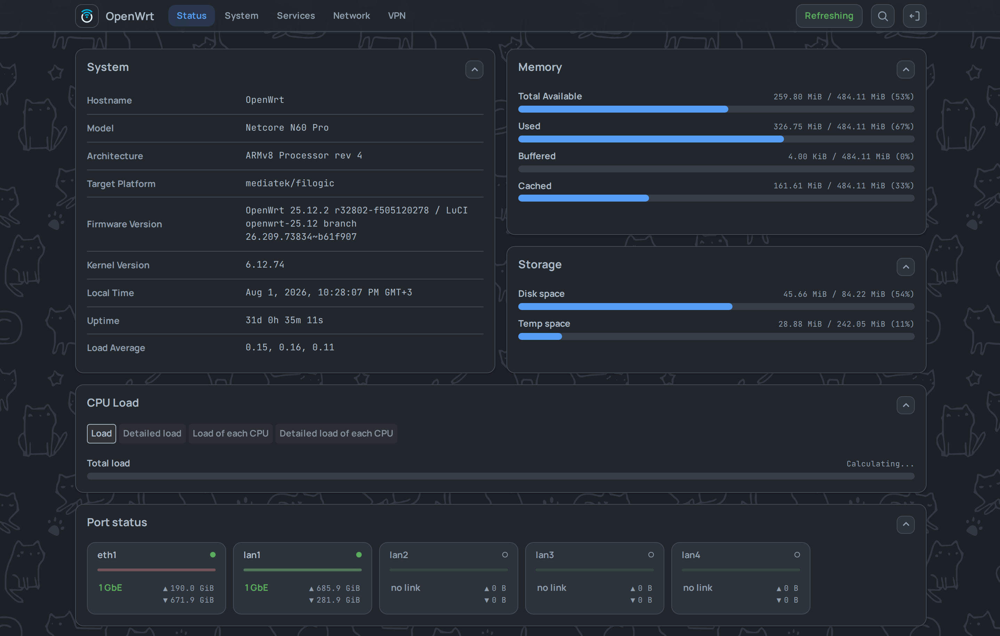

# luci-theme-footstrap

A LuCI theme for OpenWrt 24.10 and newer. It depends only on `luci-base`, styles every LuCI page
including third-party `luci-app-*` pages, and leaves alone what an app styles itself. It works on a phone and installs to its home screen,
and has 21 appearance settings (layout, palette, density, colours, wallpaper) that apply without a
reload.

[Русский](README_ru.md) · [Playground: the theme in your browser, no router needed](https://vizzletf.github.io/luci-theme-footstrap/playground/)

<picture>
  <source media="(max-width: 767px)" srcset="assets/readme/phone-menu-dark.png">
  
</picture>

## Install

Needs OpenWrt 24.10 or newer, and a browser from Chrome 108, Firefox 101 or Safari 15.4 on. On
23.05 the installer installs 0.14.2: later versions use a LuCI widget that 23.05 lacks.

Run as root on the router, over SSH:

```sh
wget -qO- https://raw.githubusercontent.com/VizzleTF/luci-theme-footstrap/main/install.sh | sh
```

The script adds the theme's package feed, verifies the package's signature and checksum, installs the theme and prints what it did: installed,
upgraded from a named version, or already current. Later versions arrive with the router's own
`apk upgrade` or `opkg upgrade`.

If `raw.githubusercontent.com` answers 429 (a shared exit or CGNAT), run the signed copy attached to
the latest release:

```sh
wget -qO- https://github.com/VizzleTF/luci-theme-footstrap/releases/latest/download/install.sh | sh
```

Then open **System → System → Language and Style**, set **Design** to **Footstrap** and click
**Save & Apply**. To remove the theme, run `apk del luci-theme-footstrap` (or
`opkg remove luci-theme-footstrap`); LuCI falls back to bootstrap.

## Speed

On the same router, the median page paints 3.03× faster than with the stock bootstrap theme. A
38-page tour takes 4.9 s instead of 11.3 s. Method and data: [docs/benchmark.md](docs/benchmark.md).

## Links

- [Screenshots](docs/screenshots/)
- [Developer documentation](docs/README.md): start with [architecture.md](docs/architecture.md)
  and [conventions.md](docs/conventions.md)
- [Styling a `luci-app` for any theme](docs/luci-app-styling-guide.md) and the
  [devkit](https://vizzletf.github.io/luci-theme-footstrap/) that checks its CSS
- [Changelog](CHANGELOG.md) · [Package feed](https://owfeed.org/install/) ·
  [License: Apache-2.0](LICENSE)
